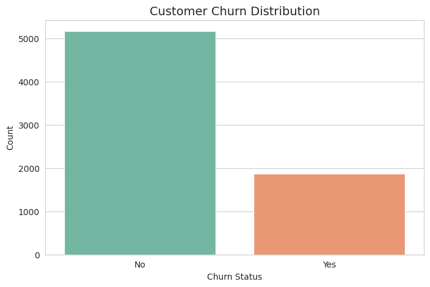
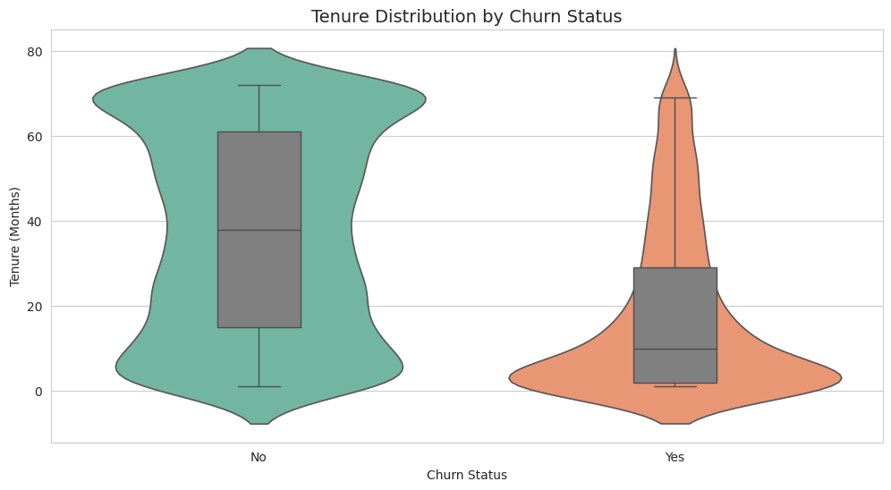
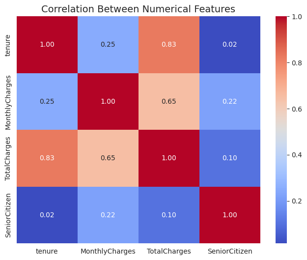
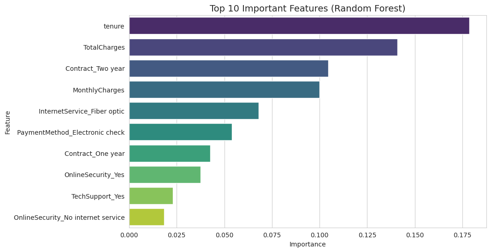
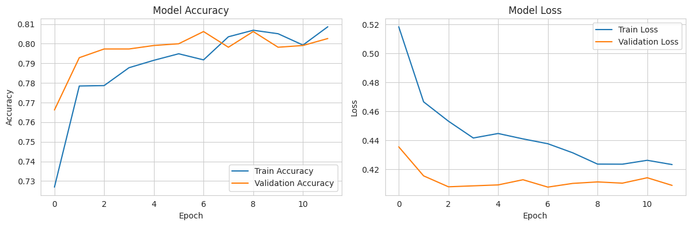

# 🔮 Telco Customer Churn Prediction

[](https://www.python.org/)
[](https://www.tensorflow.org/)
[](https://opensource.org/licenses/MIT)
[](https://www.kaggle.com/datasets/blastchar/telco-customer-churn)

> **End-to-end customer churn prediction** using classical machine learning and deep learning on the Telco Customer Churn dataset. Includes EDA, feature engineering, SMOTE for imbalanced data, hyperparameter tuning with Optuna, and business-driven recommendations.

---

## 📌 Overview

Customer churn is one of the biggest challenges in the telecom industry. This project aims to build a robust predictive model to identify customers who are likely to cancel their services. By analyzing behavioral patterns and contract details, we provide actionable insights to help retention teams take proactive measures.

**Key highlights:**
- ✅ Complete EDA with 3 meaningful visualizations
- ✅ Classical ML models: Logistic Regression, Random Forest, XGBoost, LightGBM
- ✅ Deep Learning: Multi-Layer Perceptron (MLP) with early stopping & dropout
- ✅ Handling imbalanced data using SMOTE + threshold tuning
- ✅ Hyperparameter optimization with Optuna
- ✅ Business recommendations based on feature importance
- ✅ Comparison of ML vs DL performance on tabular data

---

## 📁 Project Structure
```
📦 telco-churn-prediction-ml-dl
│
├── 📁 data/                                    # Data files
│   ├── telco_churn_cleaned.csv                 # Cleaned dataset after preprocessing
│   ├── X_encoded.csv                           # Feature matrix (encoded)
│   └── y_target.csv                            # Target variable (Churn)
│
├── 📁 images/                                   # Visualizations
│   ├── churn_distribution.png                   # Chart 1: Churn vs Non-Churn
│   ├── correlation_heatmap.png                  # Chart 2: Feature correlation heatmap
│   ├── feature_importance.png                   # Chart 3: Top 10 feature importance (RF)
│   ├── mlp_training_curves.png                  # Chart 4: MLP training curves
│   └── tenure_vs_churn.png                      # Chart 5: Tenure distribution by churn
│
├── 📁 models/                                   # Saved trained models
│   ├── best_model_random_forest.pkl             # Best performing model (Random Forest)
│   └── scaler.pkl                               # Fitted StandardScaler for inference
│
├── 📓 analysis.ipynb                            # Main Jupyter Notebook
├── 📄 requirements.txt                          # Python dependencies
├── 📄 LICENSE                                   # MIT License
└── 📄 README.md                                 # Project documentation (this file)
```
## 🚀 Getting Started

### 1. Clone the repository
```bash
git clone https://github.com/yourusername/telco-churn-prediction-ml-dl.git
cd telco-churn-prediction-ml-dl
```
### 2. Install dependencies
```bash
pip install -r requirements.txt
```
### 3. Run the Jupyter Notebook
```bash
jupyter notebook analysis.ipynb
```
### 4. (Optional) Use the saved model for inference
```bash
import joblib
import pandas as pd

# Load model and scaler
model = joblib.load('models/best_model_random_forest.pkl')
scaler = joblib.load('models/scaler.pkl')

# Load new data (must match training features)
X_new = pd.read_csv('data/X_encoded.csv')
X_new_scaled = scaler.transform(X_new)

# Predict churn probability
probs = model.predict_proba(X_new_scaled)[:, 1]

# Apply optimal threshold (0.387 for Random Forest)
predictions = (probs >= 0.387).astype(int)
```
## 📊 Visualizations

### 1. Churn Distribution


### 2. Tenure vs Churn


### 3. Correlation Heatmap


### 4. Feature Importance (Random Forest)


### 5. MLP Training Curves


---

## 🔧 Preprocessing & Feature Engineering

- **One-Hot Encoding** for all categorical variables
- **Standardization** (StandardScaler) for distance-based models (Logistic Regression, MLP)
- **Train/Test Split** with stratification (80/20) to preserve class distribution

### Handling Imbalanced Data
- **SMOTE** (Synthetic Minority Over-sampling Technique) applied to training data
- **Threshold tuning** to optimize F1-score for the minority (churn) class
  - Random Forest optimal threshold: **0.387**
  - LightGBM optimal threshold: **0.379**

---

## 🤖 Models Implemented

| Category | Model | Status |
|----------|-------|--------|
| **Baseline** | Logistic Regression | ✅ |
| **Classical ML** | Random Forest | ✅ (Best Model) |
| | XGBoost | ✅ |
| | LightGBM (Base) | ✅ |
| | LightGBM (Optuna-optimized) | ✅ |
| **Deep Learning** | MLP (Multi-Layer Perceptron) with Dropout & Early Stopping | ✅ |

---

## 📈 Results & Model Comparison

| Model | F1 (Churn) | Precision (Churn) | Recall (Churn) |
|-------|------------|-------------------|----------------|
| **Random Forest (SMOTE + Threshold Tuning)** | **0.629** | 0.51 | 0.80 |
| LightGBM (SMOTE + Threshold Tuning) | 0.625 | 0.51 | 0.80 |
| Neural Network (Optimal Threshold) | 0.624 | 0.54 | 0.74 |
| LightGBM (Base) | 0.622 | 0.52 | 0.77 |
| Random Forest (Base) | 0.620 | 0.54 | 0.75 |
| XGBoost | 0.606 | 0.48 | 0.81 |
| Logistic Regression | 0.609 | 0.65 | 0.57 |
| LightGBM (Optuna-optimized) | 0.583 | 0.64 | 0.53 |

> ✅ **Best Model:** Random Forest with SMOTE and optimal threshold tuning achieved the highest F1-score of **0.629** for the churn class.

### Key Findings
1. **Classical ML models (Random Forest, LightGBM) outperform deep learning (MLP)** on this tabular dataset with ~7,000 records.
2. **SMOTE + Threshold Tuning** significantly improves recall for the churn class (from ~0.75 to ~0.80) while maintaining reasonable precision.
3. **Tenure, Contract Type, and Monthly Charges** are the top three most important features driving churn.

---

## 💡 Business Recommendations

Based on feature importance analysis and model insights:

| Strategy | Action |
|----------|--------|
| **Early-Stage Retention** | Target customers in their first 3–6 months with loyalty rewards or free service upgrades. |
| **Contract Migration** | Encourage month-to-month subscribers to switch to 1-year or 2-year plans with a 5–10% discount. |
| **Service Bundling** | Offer free trials of Online Security & Tech Support to high-risk customers. |
| **Proactive Alerts** | Deploy the model with optimal threshold (~0.387) to generate daily "high-risk" lists for the sales team. |

---

## 🧰 Technologies Used

| Category | Tools & Libraries |
|----------|-------------------|
| **Language** | Python 3.9+ |
| **Data Manipulation** | Pandas, NumPy |
| **Visualization** | Matplotlib, Seaborn |
| **Classical ML** | Scikit-learn (Logistic Regression, Random Forest) |
| **Gradient Boosting** | XGBoost, LightGBM |
| **Deep Learning** | TensorFlow / Keras (MLP) |
| **Hyperparameter Tuning** | Optuna |
| **Imbalanced Data** | Imbalanced-learn (SMOTE) |
| **Model Serialization** | Joblib |

---

## 📝 Conclusion

This project successfully demonstrates that **classical ensemble models (Random Forest & LightGBM) outperform deep learning (MLP)** on structured tabular data with moderate sample size (~7,000 records). 

The **Random Forest model with SMOTE and threshold tuning** achieved the highest F1-score (0.629) for the churn class, making it the most suitable choice for deployment in a production environment.

**Why Random Forest over MLP?**
- ✅ Better interpretability (feature importance)
- ✅ No need for feature scaling
- ✅ Faster training and inference
- ✅ Better generalization on tabular data

While the deep learning model showed competitive performance, it required more computational resources and careful tuning. For this business problem, the interpretability and performance of Random Forest make it the preferred solution.

---

## 📄 License

This project is licensed under the MIT License – see the [LICENSE](LICENSE) file for details.

---

## 👤 Author

**Samyar Zamani**  
[GitHub](https://github.com/SamyarZamani) • [LinkedIn](https://linkedin.com/in/samyar-zamani-71003537b)

---

## 🙏 Acknowledgments

- Dataset provided by [Kaggle](https://www.kaggle.com/datasets/blastchar/telco-customer-churn)
- Inspired by real-world telecom retention challenges

---

**📅 Date:** 2026-07-07
